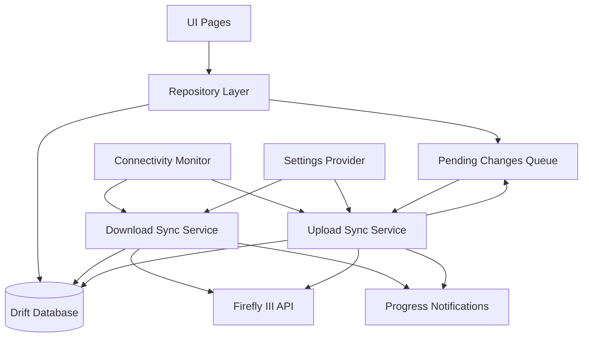

# Local Data Storage and Background Synchroniza

tionThis plan implements a complete local-first architecture where all UI interactions use local database storage instead of direct API calls. A background synchronization service keeps data in sync with the Firefly III API.

## Architecture Overview




## Implementation Steps

### 1. Database Schema (Drift)

**File**: `lib/data/local/database/app_database.dart`Create Drift database with tables for:

- **Transactions** (`transactions` table): Store all transaction data with JSON serialization
- **Accounts** (`accounts` table): Asset, expense, revenue, liability accounts
- **Categories** (`categories` table): Category definitions
- **Tags** (`tags` table): Tag definitions
- **Bills** (`bills` table): Bill information
- **Budgets** (`budgets` table): Budget definitions and limits
- **Currencies** (`currencies` table): Currency information
- **Piggy Banks** (`piggy_banks` table): Piggy bank data
- **Attachments** (`attachments` table): Attachment metadata (files stored separately)
- **Insights** (`insights` table): Cached insight data (expense/income/transfer totals and grouped insights by category/tag/bill/budget)
- `insight_type` (expense/income/transfer)
- `insight_subtype` (category/tag/bill/budget/total/no-category/no-tag/etc.)
- `start_date` and `end_date` (date range for the insight)
- `data` (JSON blob of InsightTotalEntry, InsightGroupEntry, or InsightTransferEntry list)
- `cached_at` (timestamp when cached)
- `stale` (boolean flag - true when cache is invalidated but data is kept for offline use)
- Composite unique key on (insight_type, insight_subtype, start_date, end_date)
- **Sync Metadata** (`sync_metadata` table): Track last sync time per entity type
- `entity_type` (primary key)
- `last_download_sync` (timestamp of last successful download)
- `last_upload_sync` (timestamp of last successful upload)
- `last_full_sync` (timestamp of last full sync)
- `sync_paused` (boolean flag - true when sync is paused due to errors)
- `retry_count` (number of consecutive failures)
- `next_retry_at` (timestamp when sync should be retried - null if not paused)
- `last_error` (error message from last failed sync attempt)
- **Pending Changes** (`pending_changes` table): Queue of local changes to sync (CREATE/UPDATE/DELETE operations)
- `id` (primary key, auto-increment)
- `entity_type` (transactions/accounts/categories/etc.)
- `entity_id` (ID of the entity, null for CREATE operations)
- `operation` (CREATE/UPDATE/DELETE)
- `data` (JSON blob of entity data for CREATE/UPDATE, null for DELETE)
- `created_at` (timestamp when change was queued)
- `retry_count` (number of upload attempts)
- `last_error` (error message from last failed attempt, null if successful)
- `synced` (boolean flag indicating if upload was successful)

Each entity table includes:

- `id` (primary key)
- `data` (JSON blob of full entity)
- `updated_at` (last modified timestamp from API)
- `local_updated_at` (timestamp of local modification)
- `synced` (boolean flag for sync status)

### 2. Repository Layer

**Files**:

- `lib/data/repositories/transaction_repository.dart`
- `lib/data/repositories/account_repository.dart`
- `lib/data/repositories/category_repository.dart`
- `lib/data/repositories/tag_repository.dart`
- `lib/data/repositories/bill_repository.dart`
- `lib/data/repositories/budget_repository.dart`
- `lib/data/repositories/currency_repository.dart`
- `lib/data/repositories/piggy_bank_repository.dart`
- `lib/data/repositories/insight_repository.dart`

**Note on Insights**: Insights are computed/aggregated data derived from transactions. The insight repository caches API responses for specific date ranges. When transactions are created/updated/deleted, the insight cache for affected date ranges should be marked as `stale = true` but **not deleted**. The UI will continue to use stale insights until the device comes online and sync refreshes them. This ensures the app works fully offline with potentially outdated but still useful data.

- `getAll()`: Query local database
- `getById(String id)`: Get single entity
- `search(String query)`: Local search
- `create(T entity)`: Create locally and queue sync
- Insert entity into local database with `synced = false`
- Add entry to `pending_changes` table with operation = CREATE
- Return immediately (non-blocking)
- `update(T entity)`: Update locally and queue sync
- Update entity in local database with `synced = false`, update `local_updated_at`
- Add/update entry in `pending_changes` table with operation = UPDATE
- Return immediately (non-blocking)
- `delete(String id)`: Delete locally and queue sync
- Mark entity as deleted in local database (soft delete or flag)
- Add entry to `pending_changes` table with operation = DELETE
- Return immediately (non-blocking)
- `getByDateRange(DateTime start, DateTime end)`: Date-filtered queries

**Insight Repository** (`insight_repository.dart`) provides:

- `getTotal(String type, DateTime start, DateTime end)`: Get total insights (expense/income/transfer) - returns `List<InsightTotalEntry>`
- Returns cached data even if `stale = true` (prioritizes offline functionality)
- Only fetches from API if no cached data exists and device is online
- `getGrouped(String type, String subtype, DateTime start, DateTime end)`: Get grouped insights (by category/tag/bill/budget) - returns `List<InsightGroupEntry>`
- Returns cached data even if `stale = true` (prioritizes offline functionality)
- Only fetches from API if no cached data exists and device is online
- `getNoGroup(String type, String subtype, DateTime start, DateTime end)`: Get "no category/tag/bill/budget" insights - returns `List<InsightTotalEntry>`
- Returns cached data even if `stale = true` (prioritizes offline functionality)
- Only fetches from API if no cached data exists and device is online
- `cacheInsight(String type, String subtype, DateTime start, DateTime end, dynamic data)`: Cache insight data, sets `stale = false`
- `markStale(DateTime? start, DateTime? end)`: Mark cached insights as stale (sets `stale = true`) when transactions change in date range
- **Does NOT delete** the cached data - keeps it for offline use
- UI will continue to display stale insights until sync refreshes them
- `markStaleForTransaction(TransactionRead transaction)`: Helper to mark cache as stale for a transaction's date range
- `refreshStaleInsights()`: Called by sync service to refresh all stale insights when online

Repositories read from local database only - no direct API calls.

### 3. Background Sync Service

**File**: `lib/services/sync/sync_service.dart`**Features**:

- Incremental sync using `updated_at` timestamps
- Fetch transactions ordered by `updated_at DESC`, stop when encountering already-synced items
- Conflict resolution: Last modified timestamp wins
- Deduplication: Track sync conflicts and log decisions
- Progress tracking: Emit progress events for notifications
- Mobile data check: Respect user preference (disabled by default)
- Entity-specific sync: Support syncing individual entity types
- Full sync: Option to force complete re-sync
- Insights sync: Sync insights data and cache for common date ranges (current month, last 3 months, etc.)
- **Bidirectional sync**: Upload local changes to server and download server changes

**Sync Strategy (Download from Server)**:

1. **Validate credentials** (as part of sync, not at startup):

- If credentials not validated yet, attempt to validate with API
- On 401/403 error: Mark credentials as invalid, notify user, continue with local data only
- On success: Store validated credentials, proceed with sync

2. Check if sync is paused (`sync_paused = true`):

- If paused, check if `next_retry_at` has passed
- If not yet time to retry: Skip sync, return early
- If time to retry: Reset pause state and continue

3. Check connectivity and mobile data settings
4. For each entity type, fetch from API starting with most recently modified
5. Compare `updated_at` with local database
6. If server is newer: Update local database
7. If local is newer: Check if local change is already queued for upload

- If queued: Skip (will be handled by upload process)
- If not queued: This indicates a conflict - server wins (last modified), log decision

8. If conflict (same `updated_at` but different data): Server wins (last modified), log decision
9. On success: Update sync metadata with last sync time, reset `retry_count = 0`, set `sync_paused = false`
10. On error:

    - **401/403 (authentication errors)**: 
    - Mark credentials as invalid
    - Show notification to user that credentials need to be re-entered
    - Pause sync until credentials are updated
    - Do NOT use exponential backoff for auth errors
    - **Network issues, timeouts, 5xx errors**:
    - Increment `retry_count`
    - Calculate exponential backoff: `backoff_seconds = min(2^retry_count * 60, 3600)` (max 1 hour)
    - Set `next_retry_at = now + backoff_seconds`
    - Set `sync_paused = true`
    - Store error in `last_error`
    - Log error and pause state
    - Do NOT retry immediately - wait for next sync cycle or manual trigger

**Sync Strategy (Upload to Server)**:

1. Check connectivity and mobile data settings
2. Query `pending_changes` table for unsynced changes (where `synced = false`)
3. For each pending change:

- **CREATE**: Call API POST endpoint (e.g., `v1TransactionsPost`)
    - On success: Update entity with server response (get server ID and `updated_at`), mark as synced, remove from queue
    - On failure: Increment `retry_count`, store error in `last_error`, keep in queue (max retries: 3)
- **UPDATE**: Call API PUT endpoint (e.g., `v1TransactionsIdPut`)
    - On success: Update local entity with server response, mark as synced, remove from queue
    - On failure: Increment `retry_count`, store error in `last_error`, keep in queue (max retries: 3)
    - If 404 (entity deleted on server): Mark local entity as deleted, remove from queue, log conflict
- **DELETE**: Call API DELETE endpoint (e.g., `v1TransactionsIdDelete`)
    - On success: Mark as synced, remove from queue
    - On failure: Increment `retry_count`, store error in `last_error`, keep in queue (max retries: 3)
    - If 404 (already deleted): Mark as synced, remove from queue

4. Handle conflicts during upload:

- If server returns 409 Conflict or entity was modified on server since local change:
    - Compare `updated_at` timestamps
    - If server is newer: Cancel local change, update local entity with server version, mark as synced, remove from queue, log conflict
    - If local is newer (shouldn't happen if sync is working correctly): Retry upload

5. After successful uploads, mark related insight cache entries as stale (set `stale = true`)
6. Update sync metadata with last upload time
7. Refresh stale insights (if any) by fetching from API and updating cache with `stale = false`

**Insights Sync Strategy**:

- Insights are computed/aggregated data, not directly syncable entities
- Sync service will pre-populate insights cache for common date ranges:
- Current month (for dashboard)
- Last 3 months (for charts)
- Current year (for annual views)
- When transactions are synced (downloaded or uploaded), mark affected insight cache entries as `stale = true`
- **Do NOT delete** stale insights - keep them for offline use
- During sync, refresh all stale insights:
- Query insights table for entries where `stale = true`
- Fetch fresh data from API for each stale insight
- Update cache with fresh data and set `stale = false`
- Insights can be refreshed on-demand via repository methods (only if online)
- **UI Behavior**: Always use cached insights (even if stale) - never show errors or empty states due to stale data

### 4. Upload Service

**File**: `lib/services/sync/upload_service.dart`**Features**:

- Process pending changes queue (CREATE/UPDATE/DELETE operations)
- Upload local changes to Firefly III API
- Retry logic with exponential backoff (max 3 retries)
- Conflict resolution during upload
- Progress tracking for upload operations
- Mobile data check: Respect user preference (disabled by default)
- Batch processing: Process multiple changes efficiently

**Upload Flow**:

1. Check if upload sync is paused (`sync_metadata` where `entity_type = 'upload'` and `sync_paused = true`):

- If paused, check if `next_retry_at` has passed
- If not yet time to retry: Skip upload, return early
- If time to retry: Reset pause state and continue

2. Query `pending_changes` table for unsynced entries (`synced = false`)
3. Sort by `created_at` (FIFO - process oldest first)
4. For each pending change:

- Check connectivity and mobile data settings
- Execute appropriate API call (POST/PUT/DELETE)
- Handle response:
    - **Success**: Update local entity, mark as synced, remove from queue
    - **Network error/Timeout/5xx error**: Pause upload sync with exponential backoff (see error handling below)
    - **4xx errors (except 404/409)**: Increment item `retry_count`, store error, keep in queue (if retries < 3)
    - **404 errors**: Entity deleted on server - mark as synced, remove from queue
    - **409 conflicts**: Resolve conflict, update local entity, log decision

5. After successful uploads, mark related insight cache entries as stale (set `stale = true`)
6. On success: Update sync metadata with last upload time, reset `retry_count = 0`, set `sync_paused = false`
7. Refresh stale insights (if any) by fetching from API and updating cache with `stale = false`

**Error Handling**:

- **Network errors, timeouts, 5xx errors** (for entire upload sync):
- Increment upload sync `retry_count` in sync_metadata
- Calculate exponential backoff: `backoff_seconds = min(2^retry_count * 60, 3600)` (max 1 hour)
- Set `next_retry_at = now + backoff_seconds`
- Set `sync_paused = true` for upload sync
- Store error in `last_error`
- Log error and pause state
- Pause entire upload sync (don't process remaining items in queue)
- Do NOT retry immediately - wait for next sync cycle or manual trigger
- **404 errors** (per item): Entity deleted on server - mark as synced, remove from queue
- **409 conflicts** (per item): Resolve using conflict resolver
- **400/422 validation errors** (per item): Log error, mark for user review (don't retry automatically, max 3 retries)
- **Max retries exceeded** (per item): Mark as failed, show notification to user

**Exponential Backoff Formula**:

- First retry: 2 minutes (2^1 * 60)
- Second retry: 4 minutes (2^2 * 60)
- Third retry: 8 minutes (2^3 * 60)
- Fourth retry: 16 minutes (2^4 * 60)
- Maximum: 60 minutes (1 hour)
- After successful sync: Reset retry_count to 0

### 5. Connectivity Service

**File**: `lib/services/connectivity/connectivity_service.dart`Monitor network status:

- Detect when device comes online
- Trigger automatic sync when online (if not paused or if pause period has expired)
- Prevent sync attempts when offline
- Check mobile data vs WiFi status
- Respect mobile data sync setting
- Check sync pause state before triggering sync:
- If sync is paused and `next_retry_at` hasn't passed: Don't trigger
- If sync is paused and `next_retry_at` has passed: Reset pause state and trigger sync

### 5. WorkManager Integration

**File**: `lib/services/sync/workmanager_sync.dart`Use `workmanager` package for background sync:

- Periodic sync task (every 15-30 minutes when online)
- Runs both download sync (from server) and upload sync (to server)
- Checks connectivity before starting
- Respects mobile data setting
- Checks sync pause state - skips if paused and retry time hasn't passed
- Automatically resumes sync when retry time arrives
- One-off sync task for manual triggers
- Can trigger download-only, upload-only, or both
- Manual triggers can override pause state (force retry)
- Foreground service with notification for active sync
- Shows progress for both download and upload operations
- Separate progress indicators for each direction
- Shows pause state and next retry time if sync is paused
- Keep-alive notification to prevent process termination

**Android Configuration**:

- Add `workmanager` dependency
- Configure foreground service in `AndroidManifest.xml`
- Request necessary permissions

### 7. Settings Integration

**File**: `lib/settings.dart`Add new settings:

- `BoolSettings.syncUseMobileData`: Allow sync on mobile data (default: false)
- `syncLastFullSync`: Timestamp of last full sync
- `syncLastIncrementalSync`: Timestamp of last incremental sync per entity

Add sync control methods:

- `triggerSync()`: Manual sync trigger (can override pause state)
- `triggerEntitySync(String entityType)`: Sync specific entity type (can override pause state)
- `getSyncStatus()`: Current sync status and progress
- Returns pause state, retry count, next retry time, last error
- `isSyncPaused(String entityType)`: Check if sync is paused for entity type
- `getNextRetryTime(String entityType)`: Get timestamp when sync will retry

### 7. Sync Status UI

**File**: `lib/pages/settings/sync.dart`New settings page showing:

- Last sync time per entity
- Sync progress indicator
- Manual sync buttons (per entity and full sync)
- Buttons can override pause state (force retry)
- Credential status:
- Show if credentials are validated
- Show if credentials are invalid (with warning)
- "Re-enter Credentials" button if credentials are invalid
- Allow updating credentials without losing local data
- Sync pause status:
- Show if sync is paused for each entity type
- Display retry count
- Show next retry time
- Display last error message
- "Resume Now" button to force immediate retry
- Sync conflict log viewer
- Mobile data sync toggle

### 9. Migration from Current Architecture

**Replace API calls** in:

- `lib/pages/home/transactions.dart`: Use `TransactionRepository` instead of `TransStock`
- `lib/pages/accounts.dart`: Use `AccountRepository`
- `lib/pages/categories.dart`: Use `CategoryRepository`
- `lib/pages/bills.dart`: Use `BillRepository`
- `lib/pages/home/main.dart`: Use repositories for dashboard data
- Replace all `v1Insight*` API calls with `InsightRepository` methods
- **Important**: Repository will return stale insights if available - UI should display this data without errors
- Stale insights will be refreshed automatically during sync when device comes online
- `lib/pages/transaction.dart`: Use repositories for CRUD operations
- After create/update/delete, call `insightRepository.markStaleForTransaction()` to mark affected insights as stale
- `lib/stock.dart`: Replace `CatStock` insight API calls with `InsightRepository`
- Repository will return cached (potentially stale) insights for offline use
- All other pages making direct API calls

**Remove/Deprecate**:

- `lib/stock.dart`: Remove `TransStock` and `CatStock` (replaced by repositories and insight repository)
- Direct `FireflyService.api` calls in UI code
- Direct insight API calls (`v1Insight*` methods) in UI code

**Update**:

- `lib/auth.dart`: 
- Remove credential validation from `signInFromStorage()` - allow immediate access with local data
- Store credentials without validation at startup
- Move credential validation to background sync process
- Load default currency/timezone from local database at startup (if available)
- `lib/app.dart`: Initialize sync service and connectivity monitoring

### 10. Authentication and Startup Flow

**File**: `lib/auth.dart`**Startup Flow (when credentials exist)**:

1. Read credentials from secure storage (`api_host`, `api_key`)
2. If credentials exist:

- **Do NOT validate credentials** - skip API validation calls
- Load default currency and timezone from local database (if available)
- If not in local database, use defaults and fetch during first sync
- Set `_signedIn = true` immediately
- Allow user to access app with local data
- **No direct API calls at startup**

3. If credentials don't exist:

- Show login screen
- User must enter credentials and validate (this is the only time validation happens)

4. After startup (background):

- Initialize database if needed
- Check if first-time login (no sync metadata)
- If first-time: Trigger full download sync with progress notification (download all data from server)
- If returning user: Trigger incremental download sync in background (get latest changes from server)
- Trigger upload sync in background (upload any pending local changes to server)

**Credential Validation in Background Sync**:

- Credential validation happens as part of the sync process, not at startup
- During sync, if API calls fail with 401/403 (authentication errors):
- Mark credentials as invalid
- Show notification to user that credentials need to be re-entered
- Allow user to continue using local data
- User can update credentials in settings without losing local data

**New Login Flow**:

- Only when user explicitly logs in (new credentials or re-authentication):
- Validate credentials with API (check host, API key, version)
- Fetch default currency and timezone
- Store credentials in secure storage
- Trigger initial full sync

### 10. Conflict Resolution and Logging

**File**: `lib/services/sync/conflict_resolver.dart`**Conflict Types**:

1. **Download Conflicts** (server newer than local):

- Compare `updated_at` timestamps
- Server version wins (last modified)
- Log conflict decision to `sync_conflicts` table
- Update local entity with server version

2. **Upload Conflicts** (local change conflicts with server state):

- Server returns 409 Conflict or entity was modified since local change
- Compare `updated_at` timestamps
- If server is newer: Cancel local change, update local entity with server version
- Log conflict decision to `sync_conflicts` table

3. **Concurrent Modification Conflicts**:

- Both local and server have changes with same `updated_at` but different data
- Server version wins (last modified)
- Log conflict decision

**Conflict Logging**:

- Log all conflicts to `sync_conflicts` table with:
- `entity_type`, `entity_id`
- `conflict_type` (download/upload/concurrent)
- `local_updated_at`, `server_updated_at`
- `resolution` (server_wins/local_cancelled)
- `timestamp`
- Show notification to user about conflict resolution
- Display conflicts in sync status UI

### 12. Internationalization

Add localization strings for:

- Sync status messages
- Progress notifications
- Conflict warnings
- Settings labels
- Error messages
- Credential validation messages ("Credentials invalid, please re-enter")
- Startup messages ("Loading from local data...")

**File**: `lib/l10n/app_en.arb` (and other language files)

### 13. Notification Integration

**File**: `lib/services/sync/sync_notifications.dart`Use `flutter_local_notifications` for:

- Progress notifications during sync
- Sync completion notifications
- Conflict resolution notifications
- Foreground service notification (Android)

## Key Files to Create/Modify

**New Files**:

- `lib/data/local/database/app_database.dart` - Drift database definition
- `lib/data/local/database/tables/*.dart` - Drift table definitions
- `lib/data/repositories/*_repository.dart` - Repository implementations
- `lib/services/sync/sync_service.dart` - Main sync service (downloads from server)
- Implements exponential backoff retry logic
- Handles pause/resume for network errors, timeouts, 5xx errors
- `lib/services/sync/upload_service.dart` - Upload service (uploads local changes to server)
- Implements exponential backoff retry logic
- Handles pause/resume for network errors, timeouts, 5xx errors
- `lib/services/sync/workmanager_sync.dart` - WorkManager integration
- `lib/services/sync/conflict_resolver.dart` - Conflict resolution
- `lib/services/sync/sync_notifications.dart` - Sync notifications
- `lib/services/sync/retry_manager.dart` - Manages exponential backoff logic and pause state
- Calculates backoff intervals
- Tracks retry counts and next retry times
- Provides pause/resume functionality
- `lib/services/connectivity/connectivity_service.dart` - Network monitoring
- `lib/pages/settings/sync.dart` - Sync settings UI

**Modified Files**:

- `lib/auth.dart` - Remove credential validation from startup, allow immediate access with local data
- Update `signInFromStorage()` to skip API validation
- Load default currency/timezone from local cache
- Move credential validation to sync process
- `lib/settings.dart` - Add sync settings
- `lib/app.dart` - Initialize sync service
- `pubspec.yaml` - Add `drift`, `workmanager`, `connectivity_plus` dependencies
- All page files - Replace API calls with repository calls
- `android/app/src/main/AndroidManifest.xml` - Add WorkManager permissions

## Dependencies to Add

```yaml
dependencies:
  drift: ^2.14.0
  sqlite3_flutter_libs: ^0.5.18
  path_provider: ^2.1.4  # Already present
  workmanager: ^0.5.2
  connectivity_plus: ^5.0.2
```


## Testing Strategy

- Unit tests for repositories (mock database)
- Unit tests for sync service (mock API)
- Integration tests for sync flow
- Test conflict resolution logic
- Test offline/online transitions
- Test mobile data setting behavior

## Migration Path

## Remaining Tasks

### Budget Limits Support

- **Status**: ✅ Completed
- **Description**: Budget limits are fully supported in the repository and sync service.
- **Completed Tasks**:
- ✅ Budget limits table exists in database schema (`budget_limits.dart`)
- ✅ Budget limits sync implemented in sync service (`_syncBudgetLimits`)
- ✅ Budget limits upload implemented in upload service
- ✅ BudgetRepository supports budget limits (getAllBudgetLimits, getBudgetLimitsByBudgetId, getBudgetLimitsByDateRange, create/update/delete/upsertFromSync)
- ✅ Dashboard fetches budget limits from repository (`_fetchBudgets` in `home/main.dart`)

### Transaction Filter Dialog Migration

- **Status**: ✅ Completed
- **Description**: Transaction filter dialog still uses direct API calls; should be migrated to repositories.